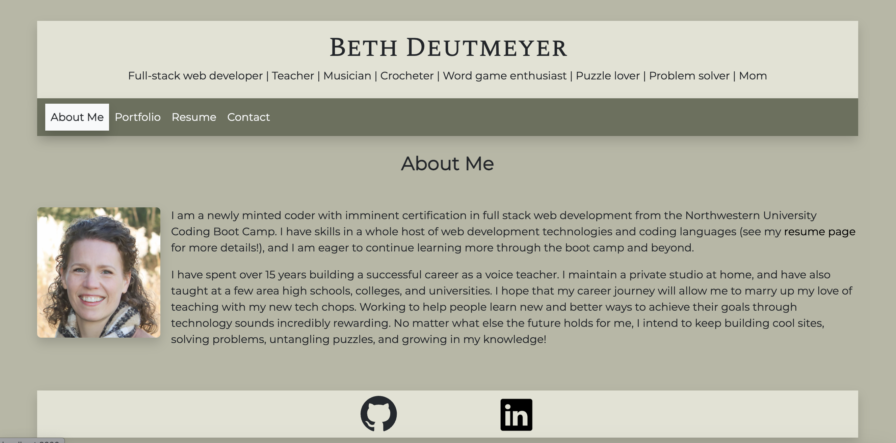

# Beth Deutmeyer WebDev Portfolio

## Description
This is a web development portfolio site. It contains an "About Me" page; a "Portfolio" page that contains screenshots of, information about, and links to several web development projects; a "Resume" page that contains a skills list and downloadable resume, and a "Contact" page.

## Screenshot

## Live link
https://lovely-meringue-5c5a8d.netlify.app/

## Repo link
https://github.com/bdeutmeyer/webdev-portfolio

## Technologies used
This portfolio was built using React. It utilizes Bootstrap and vanilla CSS for styling, as well as several npm dependencies (see package.json for details)

## License
MIT License - see license file for details.

## Credits
I utilized plenty of code snippets from the curriculum and various documentations as templates as I created this. The tailoring of that template code is my own.